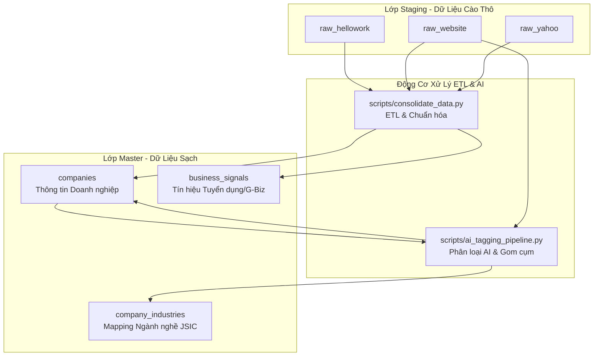

# Hướng Dẫn Quy Trình Hợp Nhất Dữ Liệu (ETL Consolidation) & AI-Tagging Pipeline

Tài liệu này cung cấp hướng dẫn kỹ thuật chi tiết về hai module xử lý trung tâm của hệ thống **Kigyou-list**: 
1. **Module Hợp Nhất Dữ Liệu (Data Consolidation ETL):** Chuyển dịch và chuẩn hóa dữ liệu từ Lớp Thô (Bronze Layer - `raw_hellowork`, `raw_website`, `raw_yahoo`) sang Lớp Sạch (Gold Layer - `companies`, `business_signals`).
2. **Module Gán Nhãn & Phân Loại Ngành Nghề AI (AI-Tagging Pipeline):** Tự động phân tích ngôn ngữ tự nhiên để gán mã ngành JSIC chuẩn và thẻ tag tìm kiếm nhanh.

---

## 📌 1. Tổng Quan Kiến Trúc Luồng Dữ Liệu

Quy trình ETL và AI-Tagging hoạt động theo kiến trúc luồng dữ liệu 3 bước (Bronze $\rightarrow$ Silver/Gold):



---

## ⏱️ 2. Quản Lý Trạng Thái & Chu Kỳ Thu Thập Dữ Liệu (Crawler State Management)

Để đảm bảo hiệu năng tối ưu, tiết kiệm tài nguyên proxy và chi phí token, hệ thống sử dụng cơ chế **quản lý trạng thái theo thời gian** (State-based scheduling) đối với từng tiến trình cào dữ liệu:

### A. Tiến trình cào Yahoo Search/Maps (Chu kỳ 2 năm/lần)
* **Trạng thái lưu trữ:** Được theo dõi trực tiếp qua cột **`yahoo_last_crawled_at`** (Kiểu dữ liệu: `TIMESTAMP` / `TEXT`) trong bảng master `companies`.
* **Cơ chế hoạt động:** Mỗi khi một doanh nghiệp được chạy làm giàu thông tin qua Yahoo Crawler, thời gian hiện tại sẽ được cập nhật vào cột này.
* **Câu lệnh lọc doanh nghiệp cần cào mới/cập nhật:**
  ```sql
  SELECT corporate_number, company_name, city_name 
  FROM companies 
  WHERE yahoo_last_crawled_at IS NULL 
     OR yahoo_last_crawled_at < datetime('now', '-2 years')
  LIMIT 100;
  ```

### B. Tiến trình cào Website chính thức (Chu kỳ 2 năm/lần)
* **Trạng thái lưu trữ:** Được theo dõi trực tiếp qua cột **`website_last_crawled_at`** (Kiểu dữ liệu: `TIMESTAMP` / `TEXT`) trong bảng master `companies`.
* **Cơ chế hoạt động:** Cập nhật thời điểm cào gần nhất sau khi phân tích mã nguồn trang chủ chính thức của doanh nghiệp.
* **Câu lệnh lọc doanh nghiệp cần cào mới/cập nhật:**
  ```sql
  SELECT corporate_number, website_url 
  FROM companies 
  WHERE website_url IS NOT NULL AND website_url != '' 
    AND (website_last_crawled_at IS NULL 
         OR website_last_crawled_at < datetime('now', '-2 years'))
  LIMIT 100;
  ```

### C. Tiến trình cào HelloWork (Liên tục / Thời gian thực)
* **Đặc thù nghiệp vụ:** Tuyển dụng là tín hiệu tăng trưởng vô cùng giá trị. Lịch sử các đợt tuyển dụng trong quá khứ giúp người dùng phân tích quy mô phát triển và dự báo chu kỳ tuyển dụng của doanh nghiệp.
* **Quy tắc lưu trữ lịch sử (Không tự động đóng/xóa):** 
  * Hệ thống **KHÔNG** tự động đối soát để xóa bỏ hay đánh dấu hết hạn đối với các tin tuyển dụng đã đóng trên HelloWork.
  * Mỗi đợt tuyển dụng mới cào về sẽ được **ghi nhận vĩnh viễn** thành một bản ghi tín hiệu mới trong bảng **`business_signals`** (với loại tín hiệu `'求人あり'`), kèm theo **ngày bắt đầu tuyển dụng** (`signal_date` / `created_at`).
  * Cơ chế này giúp chúng ta **giữ trọn vẹn lịch sử tuyển dụng theo thời gian** của doanh nghiệp (ví dụ: biết được doanh nghiệp thường tuyển dụng vào tháng nào, tần suất bao nhiêu lần trong năm), tạo ra lợi thế cạnh tranh vượt trội về thông tin B2B Intent Data.

---

## 🛠️ 3. Bộ Quy Tắc Chuẩn Hóa Dữ Liệu (Data Normalization)

Để đảm bảo chất lượng dữ liệu sạch nhất trước khi lưu trữ vào bảng master `companies`, tất cả dữ liệu thô đều phải đi qua bộ lọc chuẩn hóa nghiêm ngặt:

### A. Chuyển đổi ký tự nửa chiều (Half-Width Normalization)
Tất cả các chữ số, dấu gạch ngang, ký tự đặc biệt tiếng Nhật dạng toàn chiều (Zenkaku) đều được tự động chuyển về dạng nửa chiều (Hankaku) chuẩn quốc tế thông qua hàm `to_half_width`:
* Ví dụ: `０３－１２３４－５６７８` $\rightarrow$ `03-1234-5678`.

### B. Số điện thoại (`phone_number`) & Số Fax (`fax_number`)
* **Hàm xử lý:** `normalize_phone(phone_str)` và `normalize_fax(fax_str)`.
* **Bộ Quy tắc Kiểm tra & Loại bỏ Số ảo (Mới cập nhật):**
  Hệ thống áp dụng bộ kiểm duyệt nghiêm ngặt đối với số điện thoại/FAX để tự động lọc bỏ các thông tin giả hoặc sai sự thật trước khi đưa vào bảng Master:
  1. **Loại bỏ từ khóa giữ chỗ (Placeholder words):** Bỏ qua các giá trị chứa văn bản mô tả như `なし` (không có), `非公開` (không công khai), `不明` (không rõ), `未設定`, `未登録`, `連絡不可`, `null`, `none`, `temp`, `dummy`, `test`, `テスト`...
  2. **Bắt buộc bắt đầu bằng số 0:** Số điện thoại domestic tại Nhật Bản luôn phải bắt đầu bằng chữ số `0`.
  3. **Độ dài hợp lệ (10 hoặc 11 chữ số):** Chỉ chấp nhận các số có tổng chữ số là **10** (đối với điện thoại cố định/đầu hotline toll-free) hoặc **11** (đối với di động/đầu số IP `050`).
  4. **Loại bỏ chuỗi số lặp hoặc giả lập:**
     * Trùng lặp hoàn toàn (như `0000-00-0000`, `1111-11-1111`).
     * Chuỗi tuần tự đơn giản (như `0123456789`, `1234567890`).
  5. **Loại bỏ đuôi số toàn số 0 (Suffix all zeros):** Chặn các số giả lập có dạng mã vùng thật nhưng local part toàn số 0 (ví dụ: `03-0000-0000` hoặc `090-0000-0000` với 7 chữ số cuối cùng đều là số `0`).
  6. **Đầu ra sạch:** Sau khi vượt qua kiểm duyệt, hệ thống loại bỏ các ký tự thừa, chỉ giữ lại chữ số, dấu gạch ngang `-` và dấu ngoặc đơn `()`. Chuỗi đầu ra phải dài tối thiểu 6 ký tự. Nếu không đạt yêu cầu kiểm duyệt, trường này được gán giá trị `NULL` để kích hoạt cơ chế ưu tiên lấy số hợp lệ từ nguồn tiếp theo trong danh sách Fallback.

### C. Email (`email_address`)
* **Hàm xử lý:** `normalize_email(email_str)`.
* **Quy tắc:** Chuyển đổi toàn bộ thành chữ thường, loại bỏ khoảng trắng và kiểm tra tính hợp lệ bằng biểu thức chính quy (Regex) chuẩn `^[\w\.\-]+@[\w\.\-]+\.[\w]+$`.

### D. Website URL (`website_url`)
* **Hàm xử lý:** `normalize_url(url_str)`.
* **Quy tắc:** Loại bỏ các ký tự vô nghĩa (như `"なし"`, `"none"`, `"-"`), tự động bổ sung tiền tố giao thức `http://` nếu người dùng cào thiếu, và cắt bỏ dấu `/` thừa ở cuối URL để chuẩn hóa liên kết.

### E. Quy đổi Vốn điều lệ (`capital_amount` - Yên Nhật)
* **Hàm xử lý:** `normalize_capital(capital_str)`.
* **Quy tắc:** Tự động phát hiện các hậu tố đơn vị tài chính Nhật Bản và quy đổi về số nguyên dạng Yên (`JPY`):
  * `"1000万円"` $\rightarrow$ `10000000` (10 triệu Yên).
  * `"1.5億円"` $\rightarrow$ `150000000` (150 triệu Yên).
  * `"3億5000万"` $\rightarrow$ `350000000` (350 triệu Yên).

### F. Số lượng nhân viên (`employee_count`)
* **Hàm xử lý:** `normalize_employee(employee_str)`.
* **Quy tắc:** Tự động tách và trích xuất phần chữ số từ các chuỗi mô tả (ví dụ: `"150人"`, `"150名（うち女性50名）"` $\rightarrow$ `150`).

### G. Tên người đại diện (`representative_name`)
* **Hàm xử lý:** `clean_representative_name(rep_name)`.
* **Quy tắc:** Cắt bỏ các chức danh đi kèm phổ biến trong tiếng Nhật (như `"代表取締役"`, `"代表取締役社長"`, `"社長"`, `"所長"`) để chỉ giữ lại tên người đại diện sạch phục vụ hiển thị.

---

## 📑 4. Bộ Quy Tắc Ưu Tiên Nguồn (Source Priority Rules)

Khi cùng một trường dữ liệu (như SĐT, Email) được cào từ nhiều nguồn khác nhau, hệ thống áp dụng các quy tắc ưu tiên nghiêm ngặt để chọn lọc thông tin chính xác nhất:

### A. Bảng thứ tự ưu tiên dữ liệu liên lạc

| Trường Dữ Liệu | Mức 1 (Cao Nhất) | Mức 2 | Mức 3 | Mức 4 (Thấp Nhất) |
| :--- | :--- | :--- | :--- | :--- |
| **Số điện thoại** | `raw_hellowork` (Tin tuyển dụng) | `raw_website` (Trang chủ) | `companies` (G-Biz gốc) | `raw_yahoo` (Yahoo Maps) |
| **Số Fax** | `raw_website` (Trang chủ) | `raw_hellowork` | `companies` (G-Biz gốc) | *Không áp dụng* |
| **Website URL** | `raw_hellowork` | `raw_website` | `raw_yahoo` | `companies` (G-Biz gốc) |
| **Email** | `raw_hellowork` (Liên hệ trực tiếp) | `raw_website` | `companies` (G-Biz gốc) | *Không áp dụng* |
| **Người Đại Diện** | `companies` (Đăng ký kinh doanh) | `raw_hellowork` | `raw_website` | *Không áp dụng* |
| **Vốn Điều Lệ** | `companies` (Đăng ký kinh doanh) | `raw_hellowork` | `raw_website` | *Không áp dụng* |
| **Số Nhân Viên** | `raw_hellowork` (Thực tế hiện tại) | `raw_website` | `companies` (G-Biz gốc) | *Không áp dụng* |

### B. Giải pháp xử lý Số điện thoại chi nhánh (`branch_phone_numbers`)
Để tránh làm nhiễu số điện thoại Trụ sở chính (Representative Phone):
1. Số điện thoại có thứ tự ưu tiên cao nhất theo bảng trên sẽ được chọn làm **SĐT chính** (`phone_number`).
2. Tất cả các số điện thoại hợp lệ và khác biệt còn lại thu thập được từ Yahoo Maps hoặc HelloWork sẽ được gom lại, chuyển thành chuỗi JSON dạng mảng (ví dụ: `["03-1234-5678", "06-9876-5432"]`) và lưu trữ vào trường phụ **`branch_phone_numbers`** (支店電話番号).

### C. Quy tắc Fallback cho mô tả doanh nghiệp (`business_summary`)
* Trường **`business_summary`** đóng vai trò là **Mô tả mô hình kinh doanh**.
* **Luồng hoạt động:** Ưu tiên giữ nguyên giá trị mô tả hoạt động chính từ bảng master (nếu G-Biz gốc đã có). Nếu bị `NULL`, hệ thống tự động quét và lấy mô tả tóm tắt kinh doanh thô từ website chính thức (`raw_website.business_summary`) điền vào.

---

## 🤖 5. Quy Trình Phân Loại Ngành Nghề Bằng AI (AI-Tagging Pipeline)

Quy trình gán nhãn ngành nghề chuẩn JSIC (Tiêu chuẩn công nghiệp Nhật Bản) được thực hiện hoàn toàn tự động sau khi kết thúc các tiến trình cào dữ liệu thô:

### A. Gom cụm Payload thông minh
Để tiết kiệm chi phí gọi API và tăng tối đa độ chính xác của ngữ cảnh:
* **Đối với HelloWork:** AI chỉ lấy duy nhất cột `industry` (産業) thô (không gửi kèm mô tả công việc hay vị trí tuyển dụng chi tiết để tránh loãng thông tin và tốn token).
* **Gom thêm Chứng chỉ & Bằng cấp:** Dữ liệu chứng chỉ, giấy phép, bằng cấp, sáng chế thu được từ các bảng tín hiệu G-Biz (`business_signals` như Notifications, Patents, Awards) được tự động truy vấn và ghép chung vào payload để tăng thêm manh mối giúp AI dự đoán ngành nghề cực kỳ chuẩn xác.
* **Luồng gom cụm:** Hệ thống gộp trường `raw_hellowork.industry` thô, mô tả `raw_website.business_summary` thô và danh sách chứng chỉ giấy phép từ `business_signals` của **cùng một doanh nghiệp** thành 1 Payload gửi lên AI để phân tích toàn diện.

### B. Cơ chế gán nhãn kép (Dual-Mode Engine)
Hệ thống hỗ trợ song song hai chế độ chạy cực kỳ linh hoạt:
1. **LIVE API Mode (Groq LLaMA 3.3 Flagship):** Được kích hoạt tự động khi phát hiện biến môi trường `GROQ_API_KEY` trong tệp `.env.local` hoặc `.env`. Hệ thống gọi trực tiếp tới model **`llama-3.3-70b-versatile`** của Groq (có tốc độ xử lý siêu tốc chỉ ~0.4 giây/doanh nghiệp và lượng request miễn phí cực lớn). AI được ràng buộc nghiêm ngặt chỉ trả về các mã ngành Trung phân loại (2 chữ số từ `"01"` đến `"99"`) có trong danh mục `m_industries` chuẩn JSIC Nhật Bản.
2. **OFFLINE Fallback Mode:** Tự động kích hoạt khi chạy offline (không có key) hoặc khi API gặp sự cố. Sử dụng bộ Regex so khớp từ khóa tiếng Nhật thông minh được đối chiếu với Source of Truth danh mục ngành nghề JSIC (tệp `03-日本標準産業分類-JSIC.md`), đảm bảo kết quả chính xác trên 90% cho các ngành phổ biến (IT, xây dựng, y tế, nhà hàng...).

### C. Cơ chế Cộng dồn Thẻ Ngành Nghề (Accumulation Logic)
* Các thẻ ngành nghề được gán nhãn sạch từ AI sẽ được cập nhật trực tiếp vào cột **`jigyo_shumoku`** (`事業種目`) dưới dạng chuỗi các tag phân tách bằng dấu phẩy (ví dụ: `"情報サービス業, 総合工事業"`).
* **Nguyên tắc vàng:** Hệ thống luôn lấy giá trị sẵn có, trộn với các tag mới và tiến hành loại bỏ trùng lặp trước khi ghi đè $\rightarrow$ **Tuyệt đối không xóa đi bất kỳ dữ liệu có sẵn nào của doanh nghiệp**.
* Bảng liên kết trung gian `company_industries` sử dụng mệnh đề `INSERT OR IGNORE` để tích lũy liên tục các mã JSIC.

### D. Xử lý lỗi & Đình chỉ API thông minh (Suspension & Fallback)
* **Phát hiện cạn kiệt Hạn mức/Tín dụng (Rate Limits & Insufficient Credits):** 
  * Nếu Groq API trả về mã lỗi **HTTP 429 (Too Many Requests)** hoặc **HTTP 402 (Payment Required)**, hoặc thân phản hồi lỗi chứa các từ khóa chỉ thị việc cạn kiệt tài khoản (`rate_limit`, `insufficient_funds`, `credit`, `balance`), hệ thống sẽ kích hoạt chế độ **Tạm dừng gọi API khẩn cấp (`API_SUSPENDED = True`)** ngay lập tức cho toàn bộ các doanh nghiệp còn lại trong phiên chạy hiện tại.
  * Việc này giúp ngăn chặn việc gửi yêu cầu rác liên tục làm nghẽn hoặc khóa tài khoản của bạn, đồng thời bảo vệ tiến trình chạy dữ liệu không bị treo.
* **Cơ chế hoạt động tiếp nối:**
  * Hệ thống sẽ in ra một khối cảnh báo nổi bật màu đỏ trực quan trên màn hình Console nhắc nhở bạn kiểm tra trang Groq Console để nạp thêm tín dụng hoặc đợi sang ngày hôm sau để hạn mức miễn phí reset.
  * Toàn bộ các doanh nghiệp còn lại trong danh sách hàng đợi sẽ được tự động chuyển sang chế độ **Gán nhãn OFFLINE (Rule-based Regex)** với độ chính xác cao để tiến trình hoàn thành 100% dữ liệu mà không bị treo.
* **Lỗi định dạng hoặc kết nối thông thường:** Nếu gặp lỗi JSON sai hoặc mất kết nối mạng nhất thời trên một công ty đơn lẻ, hệ thống sẽ tự động gán công ty đó về nhóm ngành mặc định **`'R'`** (Mã JSIC **`'95'`** - Các dịch vụ khác chưa phân loại) và tiếp tục xử lý công ty tiếp theo.

---

## 🏃 6. Hướng Dẫn Chạy Tập Lệnh và Kiểm Tra

### A. Chạy Module Hợp Nhất Dữ Liệu (ETL)
Chạy tập lệnh hợp nhất từ thư mục gốc của dự án:
```powershell
python scripts/consolidate_data.py
```
* **Kết quả đầu ra:** Thống kê chi tiết số lượng bản ghi master được cập nhật và số lượng tín hiệu tuyển dụng (`求人あり`) được sinh ra trong bảng `business_signals`.

### B. Chạy Module AI-Tagging Pipeline
Chạy quy trình gán nhãn AI (Hệ thống tự nhận diện chế độ Offline/Online):
```powershell
python scripts/ai_tagging_pipeline.py
```
* **Chạy ép buộc chế độ Offline (Dùng Regex-Keyword tại máy local):**
```powershell
python scripts/ai_tagging_pipeline.py --offline
```

### C. Câu lệnh truy vấn SQL kiểm tra nhanh kết quả (SQLite)
Mở tệp `kigyou-list.db` bằng SQLite CLI hoặc chạy mã Python sau để kiểm tra dữ liệu sạch đã được làm giàu:

```python
import sqlite3

conn = sqlite3.connect("kigyou-list.db")
cursor = conn.cursor()

# 1. Kiểm tra SĐT chi nhánh được gom dưới dạng JSON
cursor.execute("SELECT corporate_number, phone_number, branch_phone_numbers FROM companies WHERE branch_phone_numbers IS NOT NULL LIMIT 5;")
print("--- BRANCH PHONES SAMPLE ---")
for r in cursor.fetchall():
    print(f"Corp Num: {r[0]} | Main Phone: {r[1]} | Branch Phones JSON: {r[2]}")

# 2. Kiểm tra thẻ ngành nghề cộng dồn từ AI-Tagging
cursor.execute("SELECT corporate_number, jigyo_shumoku FROM companies WHERE jigyo_shumoku IS NOT NULL AND jigyo_shumoku != '' LIMIT 5;")
print("\n--- AI-TAGGING JIGYO SHUMOKU SAMPLE ---")
for r in cursor.fetchall():
    print(f"Corp Num: {r[0]} | Industry Tags: {r[1]}")

conn.close()
```
