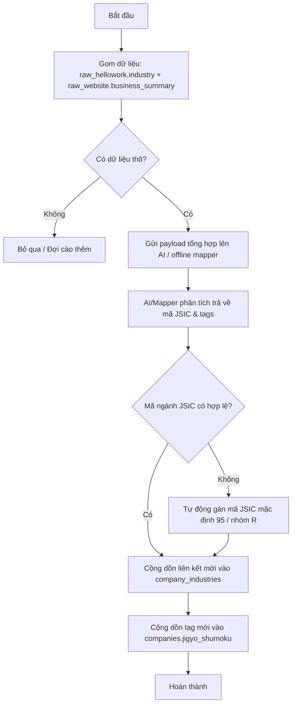

# Hướng dẫn: Quy trình Cào và Cập nhật Dữ liệu (データパイプライン)

Tài liệu này định nghĩa luồng dữ liệu 3 giai đoạn (Data Pipeline) từ việc nạp dữ liệu nền đến việc làm giàu dữ liệu bằng crawler.

## Giai đoạn 1: Dữ liệu nền tảng (基礎データの構築)

1.  **Khởi tạo (Initial Load):**
    *   Sử dụng file định dạng tại `01-法人基本情報CSVファイル.md`.
    *   Import dữ liệu CSV của hơn **5 triệu** doanh nghiệp vào Database để tạo nền móng.
    *   Khóa chính (Primary Key) sử dụng là `法人番号` (Mã số pháp nhân).
2.  **Cập nhật tự động (Daily Sync):**
    *   Ở các lần tiếp theo, hệ thống không dùng CSV tĩnh nữa mà gọi **API của Quốc thuế cục / G-Biz** hàng ngày để tự động cập nhật các thay đổi (công ty mới thành lập, đổi địa chỉ, giải thể).

## Giai đoạn 2: Tín hiệu mua hàng ban đầu (初期の購買・SEOシグナル)

1.  **Khởi tạo:**
    *   Lấy thông tin từ file cấu trúc `02-法人情報JSONファイル.md`. Các thông tin này bao gồm trợ cấp (補助金), đấu thầu (調達), bằng sáng chế (特許).
2.  **Cập nhật tự động:**
    *   Sử dụng **API của G-Biz** để đồng bộ tự động các tín hiệu này về Database. Đây là nguồn dữ liệu quan trọng cho SEO và cho tính năng "Lọc theo tín hiệu mua hàng" của Sales.

## Giai đoạn 3: Làm giàu dữ liệu (データ拡充 - Enrichment)

Do G-Biz chỉ chứa khoảng 2-5% thông tin liên hệ, chúng ta phải bổ sung bằng các Crawler nội bộ.

1.  **Yahoo Search Crawler (Yahoo検索):**
    *   **Input:** Dùng `商号または名称` (Tên công ty) + `登記住所` (Địa chỉ) truy vấn trên Yahoo Search/Maps.
    *   **Output:** Bóc tách và cập nhật thêm `電話番号` (Số điện thoại) và `WebサイトURL` (Website) vào DB.
2.  **HelloWork Crawler (ハローワーク):**
    *   **Mục tiêu 1 - Tín hiệu tuyển dụng:** Cào toàn bộ tin tuyển dụng (求人情報). Dùng `法人番号` (Mã số pháp nhân) làm **Khóa liên kết chính** với bảng chính `companies` và bảng phụ `business_signals` để xác định doanh nghiệp tuyển dụng. Mối quan hệ là **Một-Nhiều (1-N)**: một doanh nghiệp có thể có nhiều đơn tuyển dụng hoạt động đồng thời.
    *   **Mục tiêu 2 - Lấp đầy thông tin cơ bản:** Cào các thông tin cơ bản trên tin tuyển dụng: `従業員数` (Số nhân viên), `代表者名称` (Tên giám đốc), `資本金` (Vốn điều lệ) và cập nhật vào bảng chính.
    *   **Mục tiêu 3 - Phân loại ngành nghề thông qua AI-Tagging:** Cào trường `産業` (Ngành nghề do HelloWork phân loại thô) kết hợp với `職種` (Vị trí tuyển dụng) và `仕事内容` (Mô tả công việc). Vì từ ngữ viết trong trường `産業` của HelloWork thường không trùng khớp 100% với danh mục ngành nghề chuẩn JSIC của Nhật Bản, hệ thống **bắt buộc** vẫn phải gửi các thông tin ngữ cảnh này qua AI-Tagging Pipeline để AI phân tích và gán mã ngành JSIC chuẩn xác nhất.
3.  **Official Website Crawler (公式Webサイト):**
    *   **Input:** Truy cập trực tiếp vào các URL website công ty đã thu thập được.
    *   **Mục tiêu:** Cào trang chủ/trang liên hệ để trích xuất `電話番号` (Số điện thoại), email, và các thông tin cơ bản khác (giới thiệu, tầm nhìn).
    *   **Output:** Toàn bộ dữ liệu thô cào được sẽ lưu vào các bảng Raw riêng biệt (VD: `raw_website`), KHÔNG ghi đè trực tiếp vào bảng chính.

## Giai đoạn 4: Hợp nhất Dữ liệu (データ統合 - Data Consolidation)

Để giải quyết bài toán một công ty có nhiều thông tin (VD: nhiều SĐT từ HelloWork, Website, Yahoo), hệ thống áp dụng cơ chế **"Lưu trữ đa nguồn - Hiển thị nhất quán"** bằng một thuật toán chạy ngầm ở Backend (ETL Pipeline).

1.  **Chạy ngầm định kỳ (Batch Processing):**
    *   Mỗi đêm, hệ thống Backend sẽ quét các bảng dữ liệu thô (Bronze Layer: `raw_gbiz`, `raw_hellowork`, `raw_website`).
2.  **Thuật toán Ưu tiên (Priority Rules):**
    *   Áp dụng bộ quy tắc để chọn ra thông tin tốt nhất. Ví dụ đối với Số điện thoại / Số nhân viên:
        *   *Ưu tiên 1:* HelloWork (Độ mới cao, thông tin có người trực tiếp nghe máy).
        *   *Ưu tiên 2:* Official Website (Đại diện chính thức của công ty).
        *   *Ưu tiên 3:* G-Biz / Quốc thuế cục (Thông tin mang tính pháp lý).
        *   *Ưu tiên 4:* Yahoo Maps (Thông tin địa điểm kinh doanh).
3.  **Cập nhật Bảng chính (Update Master Table):**
    *   Sau khi tính toán xong, Backend sẽ thực hiện lệnh `UPDATE` vào Bảng chính (`companies`). 
    *   **Kết quả:** Giao diện UI và file tải xuống (CSV Download) của người dùng sẽ CHỈ xuất dữ liệu từ Bảng chính này (đã được làm sạch và hợp nhất tốt nhất).

## Quy tắc xử lý (ETL Rules)
*   **Entity Resolution (名寄せ):** Phải chuẩn hóa tên công ty (xóa khoảng trắng, chuyển chữ nửa width/full width) trước khi mapping dữ liệu từ Crawler vào DB để tránh tạo ra dữ liệu rác hoặc trùng lặp.

---

## Giai đoạn 5: Quy trình gán nhãn Ngành nghề bằng AI (AI-Tagging Pipeline)

Để giải quyết triệt để bài toán **"chỉ có 2% doanh nghiệp trong dữ liệu G-Biz mặc định có sẵn thẻ tag ngành nghề"**, hệ thống tích hợp quy trình sử dụng Trí tuệ Nhân tạo (LLM API - ví dụ: Gemini 1.5 Pro/Flash) để tự động hóa việc gán nhãn (Tagging) ngành nghề dựa trên dữ liệu văn bản thô đã cào quét được.

> [!IMPORTANT]
> **Quy trình gán nhãn đối với dữ liệu từ HelloWork & Website thô:**
> Quy trình AI-Tagging chạy độc lập sau khi cào hoàn tất và thực hiện hợp nhất:
> 1. **Gom cụm Payload gọi API:** Đối với mỗi doanh nghiệp, hệ thống chỉ lấy trường ngành nghề `industry` (産業) thô từ HelloWork kết hợp cùng giới thiệu `business_summary` thô từ `raw_website` để tạo thành một Payload gửi lên AI duy nhất, giúp tối ưu chi phí và tăng hiệu suất. Không cần gửi các cột vị trí tuyển dụng hay mô tả công việc thô của HelloWork.
> 2. **Cơ chế Cộng dồn (Accumulation):** Các thẻ ngành nghề được gán nhãn mới từ AI sẽ được **cộng dồn (tích lũy)** vào cột `jigyo_shumoku` (事業種目) của bảng chính `companies` và bảng trung gian `company_industries` mà **không xóa đi bất kỳ dữ liệu cũ nào có sẵn**.
> 3. **Xử lý lỗi / Fallback:** Nếu AI gặp lỗi hoặc trả về định dạng sai lệch, hệ thống sẽ tự động quy về nhóm ngành mặc định `'R'` (Mã JSIC `'95'` - Các dịch vụ khác chưa phân loại) để đảm bảo tiến trình hoạt động thông suốt.

### 1. Luồng xử lý chi tiết (AI-Tagging Pipeline Steps)



### 2. Thiết lập prompt chuẩn hóa cho AI
Để AI trả về kết quả chính xác, có định dạng cấu trúc rõ ràng (như JSON) để hệ thống tự động bóc tách mà không bị lỗi cú pháp, chúng ta sử dụng Prompt mẫu sau:

```text
Bạn là một trợ lý AI chuyên gia phân loại doanh nghiệp Nhật Bản theo Chuẩn phân loại ngành nghề chuẩn Nhật Bản (JSIC - 日本標準産業分類).
Nhiệm vụ của bạn là đọc đoạn giới thiệu/tóm tắt hoạt động kinh doanh sau đây và tìm ra các mã ngành nghề JSIC (cấp Trung phân loại - 2 chữ số) phù hợp nhất.

[DỮ LIỆU ĐẦU VÀO - GIỚI THIỆU DOANH NGHIỆP THÔ]:
"{business_summary_raw}"

[DANH MỤC NGÀNH NGHỀ JSIC THAM KHẢO]:
Hãy đối chiếu đoạn văn trên với danh mục ngành nghề JSIC tại tệp .docs/03-日本標準産業分類-JSIC.md.

[YÊU CẦU ĐẦU RA (JSON FORMAT ONLY)]:
Trả về định dạng JSON duy nhất, không kèm giải thích hoặc các ký tự markdown khác ngoài JSON:
{
  "industry_codes": ["Mã JSIC 1", "Mã JSIC 2"], // Mảng chứa từ 1 đến tối đa 3 mã ngành (2 chữ số) phù hợp nhất
  "business_summary_clean": "Đoạn tóm tắt hoạt động kinh doanh ngắn gọn, lịch sự, đã lược bỏ thông tin rác (dưới 200 ký tự)"
}
```

### 3. Quy trình Lưu trữ & Đồng bộ hóa sau khi AI xử lý
1.  **Ghi nhận mã ngành nghề**: 
    *   Đối chiếu các mã ngành `industry_codes` do AI trả về với bảng danh mục ngành nghề chuẩn `m_industries`.
    *   Với mỗi mã hợp lệ, chèn hoặc bỏ qua vào bảng **`company_industries`**:
        ```sql
        INSERT INTO company_industries (corporate_number, industry_code)
        VALUES (?, ?)
        ON CONFLICT (corporate_number, industry_code) DO NOTHING;
        ```
2.  **Làm sạch mô tả doanh nghiệp**:
    *   Lấy nội dung `business_summary_clean` (tóm tắt sạch) cập nhật trực tiếp vào trường `business_summary` của bảng master **`companies`** để hiển thị lên giao diện UI của doanh nghiệp.
        ```sql
        UPDATE companies
        SET business_summary = ?,
            updated_at = CURRENT_TIMESTAMP
        WHERE corporate_number = ?;
        ```

### 4. Quy tắc Tối ưu chi phí và Tốc độ (Optimizing Cost & Performance)
*   **Cơ chế lập lịch quét (Batching & Queue):** AI-Tagging không chạy đồng thời ngay khi cào được web, mà chạy ngầm theo lô (Batch Processing) vào khung giờ thấp điểm (đêm).
*   **Lọc trùng và Ưu tiên:** Chỉ gửi dữ liệu của các doanh nghiệp đang **"Hoạt động" (`status = '活動中'`)** và chưa có thông tin ngành nghề trong bảng `company_industries` để tiết kiệm chi phí gọi API.
*   **Sử dụng Mô hình AI phù hợp:** Ưu tiên sử dụng mô hình **Gemini 1.5 Flash** (hoặc tương đương) vì dòng mô hình này có chi phí siêu rẻ, tốc độ xử lý nhanh và độ hiểu ngữ cảnh tiếng Nhật cực tốt cho các tác vụ phân loại có cấu trúc (Structured Outputs).
