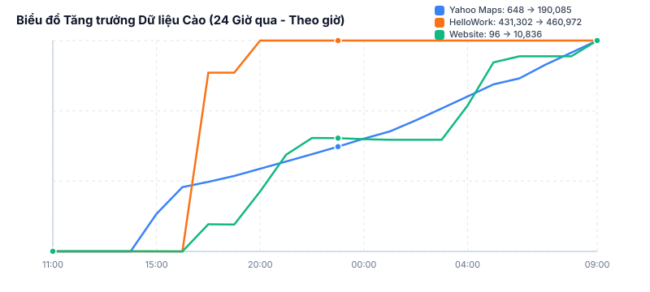
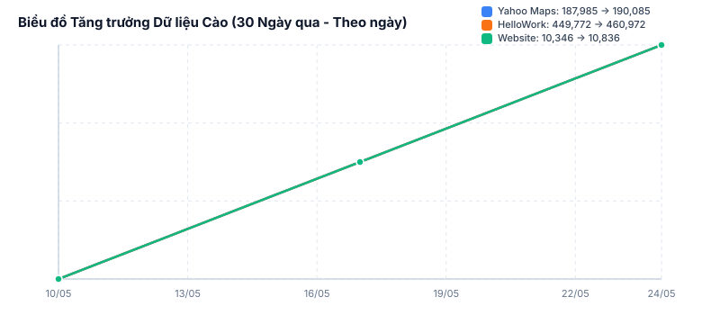
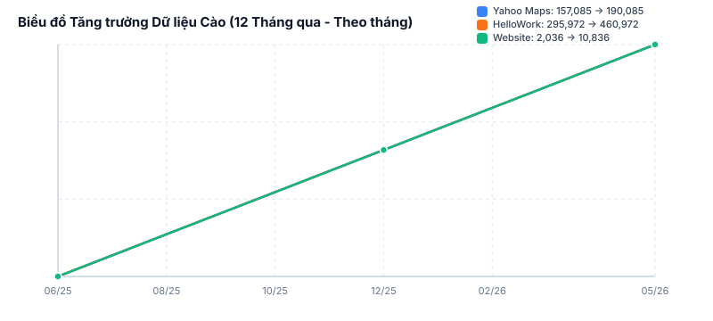
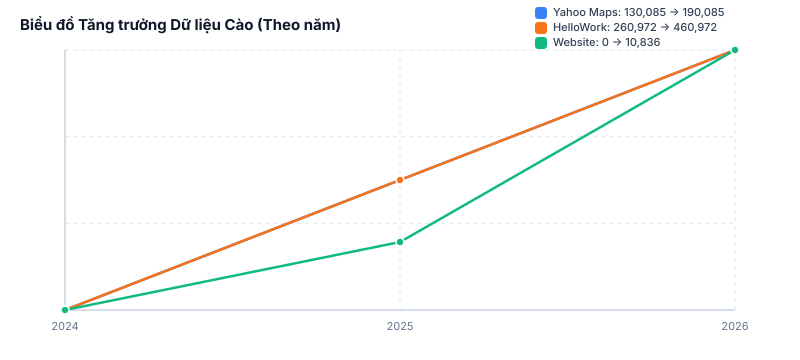

# Kigyou-List: Automated Enrichment Loop Dashboard
 
> [!NOTE]
> Trang báo cáo này được cập nhật tự động mỗi **1 tiếng** bởi Thread giám sát chạy song song trong chu trình điều phối chính.
> **Thời gian cập nhật cuối**: `2026-05-24 09:58:46`

---
 
## 📊 Trạng thái Vòng lặp Tuần hoàn Hiện tại
* **Chu kỳ hiện tại (Cycle)**: `Cycle 1`
* **Giai đoạn đang chạy**: `🎭 Đang chạy Central ETL Pipeline (Đồng bộ G-Biz, Cào Website, Phân tích AI)`
* **Trạng thái Database (SQLite)**: 🟢 Đang kết nối
 
### 📈 Lịch sử Tăng trưởng Dữ liệu Cào
* **Theo Giờ (24 Giờ qua):**

 
* **Theo Ngày (30 Ngày qua):**

 
* **Theo Tháng (12 Tháng qua):**

 
* **Theo Năm (Lịch sử các năm):**

 
### ⏱️ Thống kê dữ liệu thực tế (SQLite Master)
| Chỉ số dữ liệu | Số lượng bản ghi | Mô tả |
| :--- | :--- | :--- |
| **Tổng số doanh nghiệp (G-Biz)** | **5,061,434** | Dữ liệu nền móng từ Registry chính phủ |
| **Đã cào Yahoo Maps** | **190,085** | Bổ sung số điện thoại và tọa độ |
| **Đã cào HelloWork (Raw)** | **460,972** | Dữ liệu tuyển dụng thô từ HelloWork |
| **Đã cào Website** | **10,836** | Dữ liệu thô thu thập từ trang chủ doanh nghiệp |
| **Phân loại ngành nghề (AI)** | **398,051** | Số lượng mapping ngành nghề JSIC do AI phân tích |
| **Tín hiệu kinh doanh (Signals)** | **6,288,845** | Hojokin, Chotatsu, 特許, 表彰, 届出 |
| **Báo cáo tài chính (Financials)** | **24,124** | Doanh thu, lợi nhuận, tổng tài sản qua các năm |
 
---
 
## 🐋 Trạng thái Dịch vụ Docker Infrastructure
* **PostgreSQL Production Container (`kigyou-postgres`)**: 🟢 Active
 
---
 
## 🎭 Chi tiết Hàng đợi & Proxy HelloWork
* **Trạng thái Hàng đợi tuyển dụng (`hellowork.db`)**:
  - **Đã hoàn thành (`completed`)**: **460,972**
  - **Đang chờ cào (`pending`)**: **0**
  - **Đang xử lý (`processing`)**: **0**
  - **Thất bại quá hạn (`failed`)**: **418**
 
| Container Proxy | Trạng thái |
| :--- | :--- |
| **warp-harvester** | 🟢 Active |
| **warp-proxy** | 🟢 Active |
| **warp-proxy-2** | 🟢 Active |
| **warp-proxy-3** | 🟢 Active |

 
---
 
## 🌐 Chi tiết Hàng đợi & Proxy Website Scraper
* **Trạng thái cào trang chủ doanh nghiệp (`companies` table)**:
  - **Cào thành công (`SUCCESS`)**: **4,663**
  - **Cào thành công nhưng rỗng (`SUCCESS_EMPTY`)**: **81**
  - **Lỗi Timeout (`ERR_TIMEOUT`)**: **4**
  - **Lỗi DNS (`ERR_DNS`)**: **2**
  - **Lỗi Connection Refused (`ERR_CONNECTION_REFUSED`)**: **0**
  - **Lỗi cào khác (`ERR_FAILED`)**: **6,082**
  - **Đang chờ cào (`Pending`)**: **85,985**
 
| Container Proxy | Trạng thái |
| :--- | :--- |
| **warp-website-1** | 🟢 Active |
| **warp-website-2** | 🟢 Active |
| **warp-website-3** | 🟢 Active |
| **warp-website-4** | 🟢 Active |
| **warp-website-5** | 🟢 Active |

 
---
 
## 🗺️ Chi tiết 30 Luồng cào Yahoo Maps (Kết quả CSV)
* **Tổng số doanh nghiệp đã cào trong đợt này (CSV)**: **194,495**
 
| Cổng Proxy | Trạng thái Container | Số lượng cào được |
| :--- | :--- | :--- |
| **Port 40001** | 🟢 Active | 6,352 |
| **Port 40002** | 🟢 Active | 6,945 |
| **Port 40003** | 🟢 Active | 6,453 |
| **Port 40004** | 🟢 Active | 6,996 |
| **Port 40005** | 🟢 Active | 6,506 |
| **Port 40030** | 🟢 Active | 6,693 |
| **Port 40031** | 🟢 Active | 6,513 |
| **Port 40032** | 🟢 Active | 6,427 |
| **Port 40033** | 🟢 Active | 6,446 |
| **Port 40034** | 🟢 Active | 6,408 |
| **Port 40035** | 🟢 Active | 6,438 |
| **Port 40036** | 🟢 Active | 6,360 |
| **Port 40037** | 🟢 Active | 6,390 |
| **Port 40038** | 🟢 Active | 6,644 |
| **Port 40039** | 🟢 Active | 6,486 |
| **Port 40041** | 🟢 Active | 6,276 |
| **Port 40043** | 🟢 Active | 6,403 |
| **Port 40045** | 🟢 Active | 6,392 |
| **Port 40047** | 🟢 Active | 6,254 |
| **Port 40049** | 🟢 Active | 6,360 |
| **Port 40050** | 🟢 Active | 6,378 |
| **Port 40051** | 🟢 Active | 6,323 |
| **Port 40052** | 🟢 Active | 6,386 |
| **Port 40053** | 🟢 Active | 6,297 |
| **Port 40054** | 🟢 Active | 6,811 |
| **Port 40055** | 🟢 Active | 6,347 |
| **Port 40057** | 🟢 Active | 6,334 |
| **Port 40058** | 🟢 Active | 6,375 |
| **Port 40059** | 🟢 Active | 6,332 |
| **Port 40060** | 🟢 Active | 7,170 |

 
---
 
## 🛠️ Trạng thái Hệ thống & Logs gần nhất
* Vui lòng kiểm tra log điều phối chi tiết tại: [task-419.log](file:///C:/Users/admin/.gemini/antigravity-ide/brain/178b775f-f786-4288-9f46-76d9376f713a/.system_generated/tasks/task-419.log)
