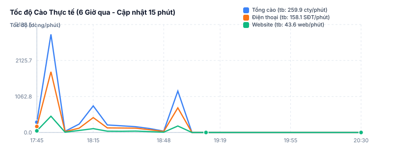
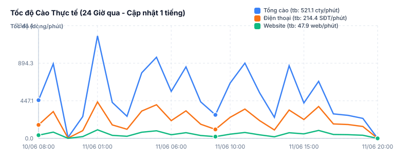

# Báo cáo Giám sát Chi tiết Yahoo Maps Crawler

* **Thời gian cập nhật báo cáo**: `2026-06-10 09:46:39`
* **Số cổng proxy hoạt động**: `🟢 52 / 53`

---

## 🚨 Trạng thái Cảnh báo Hệ thống
> [!WARNING]
> **CẢNH BÁO CỔNG PROXY**: Phát hiện 1 cổng proxy đang offline (container Docker bị dừng): `40043`...
> * Hãy khởi chạy lại daemon cào hoặc tự động khắc phục bằng Watchdog.


---

## 📈 Thống kê Tổng thể Dữ liệu (Tích lũy từ files kết quả)

| Chỉ số dữ liệu | Số lượng bản ghi | Mô tả |
| :--- | :--- | :--- |
| **Tổng số doanh nghiệp đã quét qua** | **5,378,506** | Số lượng doanh nghiệp được đọc và tìm kiếm trên Yahoo Map |
| **Số lượng Số điện thoại (SĐT) thu được** | **1,786,236** | Số lượng SĐT trích xuất thành công |
| **Số lượng Website chính thức thu được** | **409,840** | Số lượng URL website chính thức của doanh nghiệp |
| **Tỷ lệ trích xuất SĐT thành công** | **33.21%** | Hiệu năng tìm thấy thông tin liên hệ thực tế |

---

## ⚙️ Thống kê Tiến trình ETL (Đồng bộ Master & Postgres)
> [!NOTE]
> **Quy luật kích hoạt ETL**: Tiến trình ETL tự động chạy khi tổng số lượng dữ liệu cào mới **cộng gộp từ tất cả các cổng** đạt **20,000 records**, hoặc định kỳ sau mỗi **2 tiếng** (tùy điều kiện nào đến trước).

| Phân lớp dữ liệu | Số lượng bản ghi | Mô tả trạng thái |
| :--- | :--- | :--- |
| **Dữ liệu thô trong Staging (`raw_yahoo`)** | **4,817,656** | Dữ liệu Yahoo thô đã nạp thành công vào SQLite Staging (Step 3) |
| **Dữ liệu đã hợp nhất Master (`companies`)** | **4,817,647** | Số lượng doanh nghiệp đã được cập nhật dữ liệu Yahoo chính thức và đồng bộ sang **PostgreSQL** sản xuất (Step 5 & 7) |

---

## 📊 Biểu đồ Tốc độ Cào Yahoo (Lượng tăng thêm/phút)

* **Biểu đồ Tốc độ cào 15 phút (6 Giờ qua):**


* **Biểu đồ Tốc độ cào 1 Tiếng (24 Giờ qua):**


---

## 🗺️ Chi tiết Hiệu suất cào trên từng Cổng Proxy
* Bảng liệt kê chi tiết số lượng thông tin thu được và trạng thái cảnh báo chặn của từng luồng.
* **Lưu ý**: Lỗi Chặn (Gần đây) được đếm dựa trên log 200 dòng cuối để phản ánh tốc độ bị chặn theo thời gian thực.

| Cổng Proxy | Trạng thái | Đã cào (Dòng CSV) | Số Điện Thoại | Website | Lỗi Chặn (Gần đây) | Tỷ lệ SĐT (%) |
| :--- | :--- | :--- | :--- | :--- | :--- | :--- |
| **Port 40002** | 🟢 Active | 728 | 269 | 81 | 0 | 37.0% |
| **Port 40003** | 🟢 Active | 771 | 291 | 54 | 0 | 37.7% |
| **Port 40004** | 🟢 Active | 775 | 359 | 135 | 0 | 46.3% |
| **Port 40005** | 🟢 Active | 781 | 377 | 101 | 0 | 48.3% |
| **Port 40009** | 🟢 Active | 773 | 229 | 49 | 2 | 29.6% |
| **Port 40010** | 🟢 Active | 758 | 359 | 86 | 0 | 47.4% |
| **Port 40011** | 🟢 Active | 763 | 348 | 105 | 0 | 45.6% |
| **Port 40012** | 🟢 Active | 808 | 244 | 33 | 2 | 30.2% |
| **Port 40030** | 🟢 Active | 757 | 87 | 17 | 0 | 11.5% |
| **Port 40031** | 🟢 Active | 795 | 409 | 101 | 0 | 51.4% |
| **Port 40032** | 🟢 Active | 754 | 252 | 40 | 0 | 33.4% |
| **Port 40033** | 🟢 Active | 758 | 69 | 8 | 0 | 9.1% |
| **Port 40034** | 🟢 Active | 748 | 245 | 54 | 0 | 32.8% |
| **Port 40035** | 🟢 Active | 749 | 191 | 25 | 0 | 25.5% |
| **Port 40036** | 🟢 Active | 85 | 20 | 3 | 0 | 23.5% |
| **Port 40037** | 🟢 Active | 742 | 222 | 62 | 0 | 29.9% |
| **Port 40038** | 🟢 Active | 786 | 200 | 42 | 2 | 25.4% |
| **Port 40039** | 🟢 Active | 780 | 247 | 55 | 0 | 31.7% |
| **Port 40041** | 🟢 Active | 788 | 299 | 60 | 0 | 37.9% |
| **Port 40043** | 🔴 Stopped | 774 | 258 | 47 | 0 | 33.3% |
| **Port 40045** | 🟢 Active | 788 | 341 | 108 | 0 | 43.3% |
| **Port 40047** | 🟢 Active | 801 | 278 | 61 | 0 | 34.7% |
| **Port 40049** | 🟢 Active | 734 | 269 | 77 | 0 | 36.6% |
| **Port 40050** | 🟢 Active | 820 | 230 | 40 | 0 | 28.0% |
| **Port 40051** | 🟢 Active | 916 | 481 | 124 | 0 | 52.5% |
| **Port 40052** | 🟢 Active | 821 | 183 | 24 | 0 | 22.3% |
| **Port 40053** | 🟢 Active | 910 | 374 | 74 | 0 | 41.1% |
| **Port 40054** | 🟢 Active | 734 | 227 | 47 | 0 | 30.9% |
| **Port 40055** | 🟢 Active | 745 | 230 | 70 | 0 | 30.9% |
| **Port 40057** | 🟢 Active | 771 | 426 | 112 | 0 | 55.3% |
| **Port 40058** | 🟢 Active | 736 | 259 | 70 | 0 | 35.2% |
| **Port 40059** | 🟢 Active | 744 | 326 | 78 | 0 | 43.8% |
| **Port 40060** | 🟢 Active | 787 | 203 | 37 | 0 | 25.8% |
| **Port 40061** | 🟢 Active | 754 | 391 | 136 | 0 | 51.9% |
| **Port 40062** | 🟢 Active | 746 | 342 | 93 | 0 | 45.8% |
| **Port 40063** | 🟢 Active | 781 | 201 | 20 | 0 | 25.7% |
| **Port 40064** | 🟢 Active | 754 | 164 | 40 | 0 | 21.8% |
| **Port 40065** | 🟢 Active | 762 | 183 | 42 | 0 | 24.0% |
| **Port 40066** | 🟢 Active | 746 | 382 | 94 | 0 | 51.2% |
| **Port 40067** | 🟢 Active | 757 | 333 | 94 | 0 | 44.0% |
| **Port 40068** | 🟢 Active | 738 | 183 | 36 | 0 | 24.8% |
| **Port 40069** | 🟢 Active | 731 | 368 | 73 | 0 | 50.3% |
| **Port 40070** | 🟢 Active | 752 | 211 | 43 | 0 | 28.1% |
| **Port 40071** | 🟢 Active | 734 | 281 | 86 | 0 | 38.3% |
| **Port 40072** | 🟢 Active | 725 | 164 | 20 | 0 | 22.6% |
| **Port 40073** | 🟢 Active | 817 | 224 | 19 | 0 | 27.4% |
| **Port 40074** | 🟢 Active | 451 | 110 | 16 | 0 | 24.4% |
| **Port 40075** | 🟢 Active | 763 | 396 | 112 | 0 | 51.9% |
| **Port 40076** | 🟢 Active | 794 | 183 | 38 | 2 | 23.0% |
| **Port 40077** | 🟢 Active | 797 | 359 | 90 | 0 | 45.0% |
| **Port 40078** | 🟢 Active | 460 | 162 | 19 | 0 | 35.2% |
| **Port 40079** | 🟢 Active | 463 | 247 | 64 | 0 | 53.3% |
| **Port 40080** | 🟢 Active | 464 | 183 | 40 | 0 | 39.4% |


---

## 🛠️ Đề xuất Xử lý Sự cố & Giám sát Lỗi
Nếu phát hiện một hoặc nhiều cổng bị lỗi hoặc bị chặn liên tục (biểu tượng cảnh báo hiện đỏ):
1. **Khởi động lại container proxy tương ứng**:
   ```powershell
   # Ví dụ khởi động lại container warp-40060 (Watchdog hoặc Daemon sẽ tự động phát hiện và phục hồi kết nối):
   docker restart warp-40060
   ```
2. **Kiểm tra Logs chi tiết**:
   * Logs của từng cổng được lưu tại: `crawlers/yahoo/logs/crawler_[Port].log`
   * Báo cáo tiến trình chính được lưu tại: [yahoo_daemon.log](file:///C:/TUHOCLAPTRINH/kigyou-list/yahoo_daemon.log)
